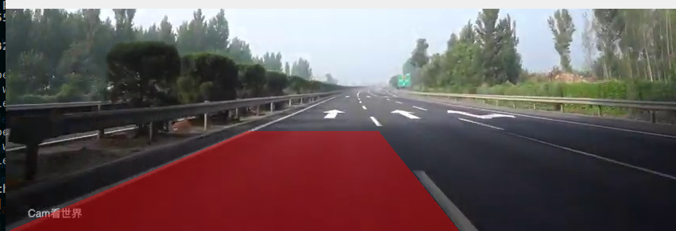
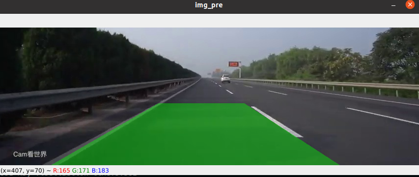

# ros_lane_departure_warning

### Introduction 

In this repository, we provide a vehicle lane departure warning package constructed on ROS. The vehicle lane detection algorithm is constructed from [UFLD](https://github.com/cfzd/Ultra-Fast-Lane-Detection) (Ultra-Fast-Lane-Detection), we provide a ROS wrapper for this algorithm. In order to deploy practical application based on USB cameras, we also provide the ROS-based usb camera driver, which is borrowed from  [ros-drivers usb_cam](https://github.com/ros-drivers/usb_cam). If this repository is useful for you, please **star** our repository.

We test our package on **Ubuntu-20.04** with **ROS-Noetic** and **PyTorch-1.8 (CUDA enabled.)**. It should be compatible with other platforms.

### Prepare

Before you run this package, you need download the UFLD network pre-trained weight and put it to `src/ros_lane_detection/ufld_weight`, you can download it from [Baidu Wang Pan](https://pan.baidu.com/s/1WHZtwFY1_55Dhn39xpEawg) (pwd: 063c)

### Usage

To test the results or develop our own codes, we provide three ROS-bag for you, you can download them form [Baidu Wang Pan](https://pan.baidu.com/s/1NxeR2uoyGXzVvRIhMwh4zw) (pwd: p4tv).

### Results illustration

